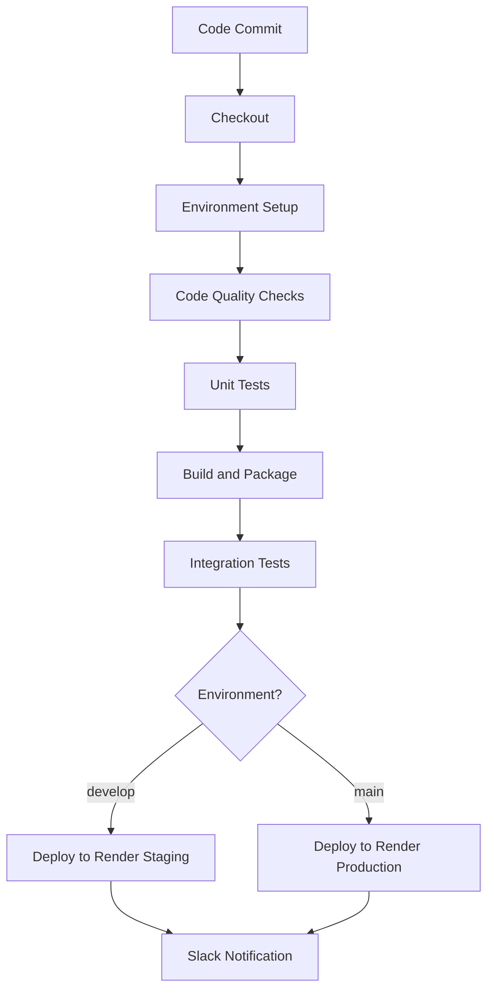

# 🚀 Jenkins CI/CD Pipeline for Stock Market Analysis App

## 📋 Overview

This project now includes a complete **industry-standard Jenkins CI/CD pipeline** with the following features:

- ✅ **Automated Testing** (Unit + Integration)
- ✅ **Code Quality Checks** (Linting, Security Scanning)
- ✅ **Render.com Deployment** (Staging + Production)
- ✅ **Security Scanning** (Bandit, Safety)
- ✅ **Coverage Reporting**
- ✅ **Slack Notifications**

## 🏗️ Pipeline Architecture



## 📁 Project Structure

```
SellerBuyerPattern/
├── main.py                 # Main Streamlit app
├── requirements.txt        # Python dependencies
├── Jenkinsfile            # CI/CD pipeline
├── docker-compose.yml     # Local development
├── pytest.ini            # Test configuration
├── .flake8               # Linting configuration
├── render.yaml           # Render.com configuration
├── .renderignore         # Render.com ignore file
├── tests/                # Test suite
│   ├── __init__.py
│   └── test_main.py
└── README-CICD.md        # This file
```

## 🔧 Jenkins Pipeline Stages

### 1. **Checkout & Environment Setup**
- Git repository checkout
- Python virtual environment creation
- Dependency installation

### 2. **Code Quality Checks** (Parallel)
- **Linting**: Flake8 code style checks
- **Security**: Bandit + Safety vulnerability scanning

### 3. **Unit Testing**
- Pytest test execution
- Coverage reporting (80% minimum)
- JUnit XML reports

### 4. **Build and Package**
- Create deployment package
- Remove unnecessary files
- Prepare for Render.com deployment

### 5. **Integration Testing**
- Local Streamlit app testing
- Yahoo Finance API validation
- Import and functionality tests

### 6. **Deployment**
- **Staging**: Automatic deployment to Render.com on `develop` branch
- **Production**: Manual approval required for Render.com on `main` branch

## 🚀 Getting Started

### Prerequisites

1. **Jenkins Server** with plugins:
   - Pipeline
   - Slack Notification
   - HTML Publisher
   - Coverage

2. **Render.com Account** with:
   - Staging service created
   - Production service created
   - Deploy hook URLs obtained

### Jenkins Setup

1. **Create New Pipeline Job**:
   ```bash
   # In Jenkins UI:
   New Item → Pipeline → Enter name → OK
   ```

2. **Configure Pipeline**:
   - **Pipeline script from SCM**: Git
   - **Repository URL**: Your Git repository
   - **Script Path**: Jenkinsfile

3. **Environment Variables**:
   ```bash
   RENDER_DEPLOY_HOOK_STAGING=https://api.render.com/deploy/srv-xxxx?key=your-staging-key
   RENDER_DEPLOY_HOOK_PRODUCTION=https://api.render.com/deploy/srv-yyyy?key=your-production-key
   SLACK_CHANNEL=#deployments
   ```

### Local Development

```bash
# Run tests locally
pytest tests/ -v --cov=.

# Run linting
flake8 .

# Test Render.com deployment locally
streamlit run main.py --server.port=8501

# Run with Docker Compose (for local development)
docker-compose up -d
```

## 🔒 Security Features

### Code Security
- **Bandit**: Python security linting
- **Safety**: Dependency vulnerability scanning

### Deployment Security
- Render.com managed security
- HTTPS by default
- Environment variable protection
- Health checks and monitoring

## 📊 Monitoring & Reporting

### Test Coverage
- **Minimum**: 80% code coverage
- **Reports**: HTML + XML formats
- **Integration**: Jenkins coverage plugin

### Quality Gates
- **Linting**: Zero critical errors
- **Security**: No high-severity vulnerabilities
- **Tests**: All tests must pass

### Notifications
- **Slack**: Build status updates
- **Email**: Failure notifications
- **Dashboard**: Jenkins Blue Ocean

## 🌍 Deployment Environments

### Staging Environment
- **Trigger**: Push to `develop` branch
- **URL**: `https://stock-market-app-staging.onrender.com`
- **Purpose**: Integration testing, UAT

### Production Environment
- **Trigger**: Push to `main` branch + Manual approval
- **URL**: `https://stock-market-app-production.onrender.com`
- **Purpose**: Live application

## 🔄 Branch Strategy

```
main (production)
├── develop (staging)
│   ├── feature/new-chart
│   ├── feature/prediction-model
│   └── bugfix/data-validation
```

## 📈 Performance Metrics

### Build Times
- **Code Quality**: ~2 minutes
- **Unit Tests**: ~3 minutes
- **Build and Package**: ~1 minute
- **Integration Tests**: ~2 minutes
- **Total Pipeline**: ~8 minutes

### Resource Usage
- **Render.com Free Plan**: 512MB RAM, 0.1 CPU
- **Render.com Starter Plan**: 512MB RAM, 0.5 CPU
- **Storage**: Minimal (Python app only)

## 🛠️ Troubleshooting

### Common Issues

1. **Render.com Deployment Fails**:
   ```bash
   # Check Render.com service logs
   # Go to Render.com dashboard → Your Service → Logs
   
   # Verify deploy hook URL
   curl -X POST "YOUR_DEPLOY_HOOK_URL"
   ```

2. **Tests Fail**:
   ```bash
   # Run tests locally
   pytest tests/ -v
   
   # Check dependencies
   pip install -r requirements.txt
   ```

3. **Streamlit App Issues**:
   ```bash
   # Test locally
   streamlit run main.py --server.port=8501
   
   # Check Render.com environment variables
   # Ensure PORT and server.address are set correctly
   ```

### Pipeline Debugging

```bash
# Enable verbose logging in Jenkinsfile
sh "set -x"

# Check environment variables
sh "env | grep -E '(RENDER|SLACK)'"
```

## 📚 Additional Resources

- [Jenkins Pipeline Documentation](https://www.jenkins.io/doc/book/pipeline/)
- [Render.com Documentation](https://render.com/docs)
- [Render.com Deploy Hooks](https://render.com/docs/deploy-hooks)
- [Streamlit Deployment Guide](https://docs.streamlit.io/streamlit-community-cloud)

## 🤝 Contributing

1. Create feature branch from `develop`
2. Make changes and add tests
3. Ensure all quality gates pass
4. Create pull request to `develop`
5. After review, merge to `develop` for staging deployment
6. Create pull request from `develop` to `main` for production

---

**🎉 Your Stock Market Analysis App is now ready for enterprise-grade CI/CD!**
