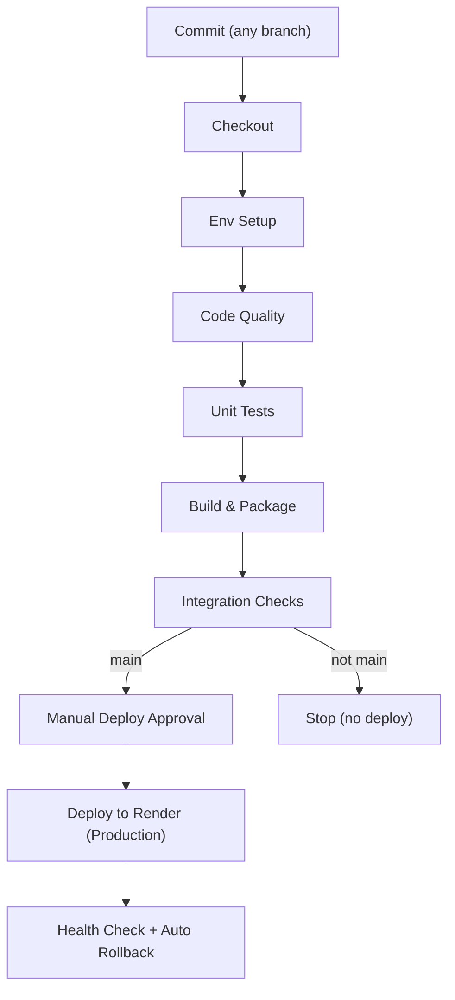

# Jenkins CI/CD Pipeline for Stock Market Analysis App

## 📋 Overview

This project uses a production‑focused Jenkins CI/CD pipeline:

- ✅ Automated testing (unit + lightweight integration)
- ✅ Code quality checks (linting with Flake8, security with Bandit/Safety)
- ✅ Render.com deployment (Production only, main branch)
- ✅ Optional auto‑rollback via Render API health checks
- ✅ Coverage reports (XML + HTML)

## 🏗️ Pipeline Architecture



## 📁 Project Structure

```
SellerBuyerPattern/
├── main.py                 # Main Streamlit app
├── requirements.txt        # Python dependencies
├── Jenkinsfile             # CI/CD pipeline (prod-only deploys)
├── Jenkinsfile.pr          # PR validation (optional)
├── pytest.ini              # Test configuration
├── .flake8                 # Linting configuration
├── render.yaml             # Render.com app config
├── .renderignore           # Render.com ignore file
├── tests/                  # Test suite
│   ├── __init__.py
│   └── test_main.py
├── README.md          # This document
└── RENDER-SETUP.md         # Render.com setup guide
```

## 🔧 Jenkins Pipeline Stages

### 1) Checkout & Environment Setup
- Git checkout
- Python virtualenv creation
- Dependency install (requirements + CI tools)

### 2) Code Quality (Parallel)
- Linting: Flake8
- Security: Bandit + Safety

### 3) Unit Tests
- Pytest execution
- Coverage (XML + HTML)
- JUnit XML results

### 4) Build & Package
- Rsync minimal deploy payload → `deploy/`
- Create versioned tarball `stock-market-app-<build>.tar.gz`

### 5) Integration Checks
- Import checks for Streamlit/Plotly/YFinance
- Simple external call check (e.g., `yf.Ticker('AAPL')`)

### 6) Deployment (Production only)
- Trigger: main/origin/main only
- Manual “Deploy?” approval in Jenkins
- Deploy via Render deploy hook
- Post‑deploy: health checks against Streamlit endpoint
- Optional: automatic rollback via Render API (if credentials configured)

## Getting Started

### Jenkins prerequisites
- Plugins: Pipeline, HTML Publisher, Coverage (or Cobertura/JUnit built‑ins)

### Render prerequisites
- One production service (web) configured for this repo
- Deploy hook URL copied from Render dashboard

### Jenkins credentials (Manage Jenkins → Credentials)
- Secret text: `RENDER_DEPLOY_HOOK_PRODUCTION` → your deploy hook URL
- Secret text (optional): `RENDER_API_KEY` → Render API key (enables auto‑rollback)
- Secret text (optional): `RENDER_SERVICE_ID` → Render service ID (enables auto‑rollback)

## Local Development

```bash
# Run tests
pytest tests/ -v --cov=.

# Lint locally
flake8 .

# Run app locally
streamlit run main.py --server.port=8501 --server.address=0.0.0.0
```

## Deployment Target

### Production
- Trigger: push to `main` (or `origin/main`) + manual approval in Jenkins
- Target: your Render.com production service
- Safety nets: health checks and optional auto‑rollback when `RENDER_API_KEY` and `RENDER_SERVICE_ID` are present

## Branch Strategy

```
main (production)
├── feature/new-thing
├── bugfix/issue-123
└── chore/update-deps
```

- Feature branches: full checks + manual code review prompt, no deploy
- Main branch: automatic code review (quality gates), deploy on approval

## Quality Gates
- Linting: no critical Flake8 errors (E9, F63, F7, F82)
- Security: no HIGH‑severity Bandit findings
- Tests: test suite completes; coverage reports generated

## Auto Rollback (optional)
If `RENDER_API_KEY` and `RENDER_SERVICE_ID` are configured, the pipeline:
- Waits post‑deploy
- Calls Render API to discover the service URL
- Probes `/_stcore/health` up to 10 attempts
- If unhealthy, restores the previous live deploy via Render API

## Troubleshooting

### “Render API credentials not configured”
- Add `RENDER_API_KEY` and `RENDER_SERVICE_ID` credentials in Jenkins (Global domain)
- Ensure they are declared in the Jenkinsfile `environment { ... }`

### “Deploy to Production stage skipped” (Jenkins stage)
- Verify the branch is `main` (pipeline logs show `Current branch: ...`)
- Confirm the manual deploy approval was clicked in Jenkins

### Integration check fails
- Validate local `streamlit run main.py`
- Re‑install deps: `pip install -r requirements.txt`

## Contributing
1. Create a feature branch from `main`
2. Implement changes and tests
3. Push branch; resolve any CI issues
4. Use Jenkins manual code review prompt for non‑main branches
5. Merge to `main` when approved; approve deploy in Jenkins

---

This setup keeps the pipeline simple (prod‑only deploys) while maintaining quality gates and safety via health checks and optional automatic rollback.
